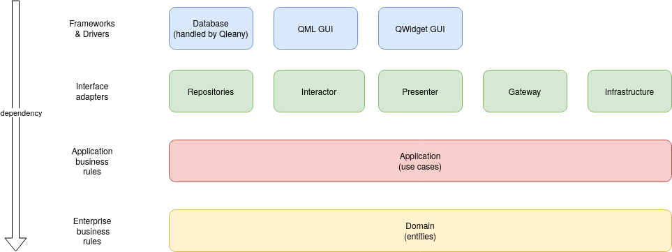
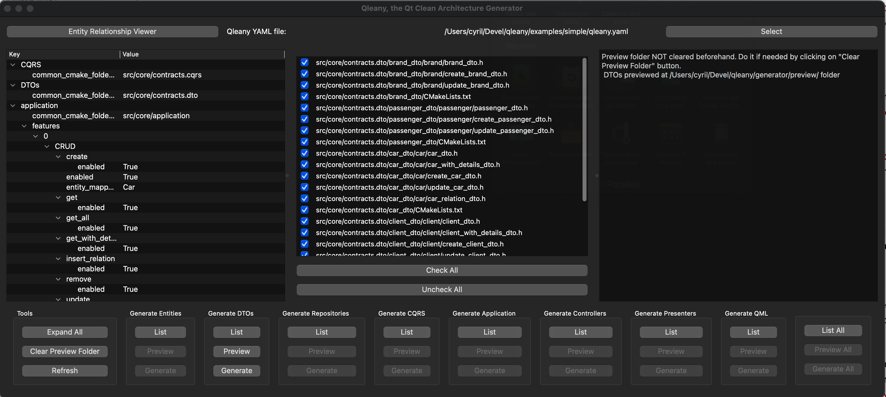

# Qleany - Clean Architecture Framework for C++/Qt6 Projects

Qleany is a streamlined framework designed to integrate Clean Architecture principles within C++ Qt6 applications. It is built on three core components:

1. **Qleany C++/Qt Library**: Provides a range of common and generic tools and classes essential for implementing Clean Architecture in C++/Qt projects.
2. **Python/Jinja2 Project Structure Generator**: Features a dedicated user interface developed using PySide. This generator facilitates the creation of a structured project environment based on the principles of Clean Architecture.
3. **Examples and Documentation**: A collection of examples to guide users in implementing the framework effectively.

## Important Notices

Please avoid using Qt Design Studio version 4.3 (which utilizes Qt 6.6) due to a known issue that impacts Qt versions 6.5.3 and 6.6. This bug can cause crashes in previews (qml2puppet) when working with QML mocks generated by Qleany. We recommend using Qt Design Studio LTS version 4.1 instead, as it is based on Qt 6.5.1 and does not exhibit this problem. Qt Design Studio 4.4 preview seems to run well with Qleany. 

## Framework's Objective

Qleany's primary goal is to automate the generation of a structured project environment for C++/Qt6 applications. This is achieved by interpreting a simple manifest file, named `qleany.yaml`, located at the root of the project. The framework generates a comprehensive structure including folders, CMakeLists.txt, and essential C++ files. The generated projects support both QWidget and QML GUIs or a combination of both. Upon initial generation, the projects are immediately compilable, requiring developers only to design GUIs and implement custom use cases.

The framework acknowledges the repetitive nature of file creation in Clean Architecture and addresses this by automating the generation of similar files. Additional features include:

- An asynchronous undo-redo system based on the command pattern.
- A SQLite-based database layer for data persistence.
- Support for custom use cases with user-defined DTOs (Data Transfer Objects) for inputs and outputs.
- The ability to define both soft and hard relationships between entities, including one-to-one and one-to-many (unordered or ordered) associations.
- Entities within the framework handle cascade deletion. Additionally, the implementation of soft-deletion (recoverable trash binning) is currently in progress.

## Framework Structure

Many developers are likely familiar with the following depiction of Clean Architecture:


It's important to note that this conceptual representation needs to be tailored to fit the specific requirements of the language and project at hand. Qleany presents a distinct interpretation of Clean Architecture, uniquely adapted and structured to suit its specific use cases and environment.

- **Domain**: Contains entities and is encapsulated in a library named `domain`.
- **Application**: Groups use cases by functionalities, organized within a library called `application`.
- **Persistence**: Manages internal data persistence. It includes a 'repository' wrapper for SQLite database interactions, with each entity having its repository in the `RepositoryProvider` class.
- **Contracts**: A common library for most other components, housing all interfaces from `persistence`, `gateway`, and `infrastructure`. This design minimizes tight coupling and circular dependencies.
- **DTO Libraries**: Each functionality has its DTO library, facilitating communication with the `application` layer. DTOs are used for both input and output in interactions with the outer layers, such as controllers.
- **Gateway**: Optional library for handling remote connections and services. It can be manually added by the developer and is used similarly to repositories in use cases.
- **Infrastructure**: Optional. Handles actions like file management, local settings, and system queries. It's injected into use cases similar to repositories and gateways.
- **Controller**: Acts as an internal API to invoke use cases, streamlining the interaction between the user interface and application logic.
- **Presenter**: Maintains Qt models and representations of unique entities (referred to as `Singles`), enhancing their integration and usage within the GUI.
- **Registration**: Each component (`persistence`, `gateway`, `infrastructure`, `controller`) initializes its classes in a corresponding *name*_registration.cpp file, typically called together in the main.cpp.

Project dependencies:


Example of project structure:


## Utilizing the Qleany GUI Interface

Qleany tooling can be installed using `pip install qleany`.

To access Qleany's user-friendly graphical interface, run `qleany` in a terminal. This interface allows developers to efficiently manage file generation. This is the recommended way to generate files.



1. **Run the Qleany GUI**:
   - Launch Qleany's graphical user interface by executing the script `generator/qleany_generator_ui.py`.

2. **Select the `qleany.yaml` File**:
   - Begin by choosing your project's `qleany.yaml` file. This configuration file is essential for the GUI to operate correctly.

3. **List Available Files**:
   - In the GUI, use the "list" button for each component. This will generate a list of files that can be created for that component.

4. **Select Files to Generate**:
   - Choose the files you want to generate from the provided list, depending on your project requirements.

5. **Preview Files**:
   - Opt for the "preview" feature to generate and inspect the selected files in a "preview" folder. The location of this folder is defined in your `qleany.yaml` file.

6. **Generate Files**:
   - After previewing, proceed to generate the files by clicking the "generate" button. This will create the files in their designated locations within your project.

7. **Overwrite Confirmation**:
   - Should the file generation process require overwriting existing files, a warning message will appear. This alert ensures you are informed about and agree to the upcoming changes to your current files.

Alternatively, you can list and generate all the files of the project.


## Qleany YAML Configuration Rules

The `qleany.yaml` file is the core configuration file for the Qleany framework. A working example can be foound in `example/simple/qleany.yaml`. Below are the rules and structure for defining the configuration:

### Global Settings
```yaml
global:
  application_name: SimpleExample
  application_cpp_domain_name: Simple
  organisation:
    name: simpleexample
    domain: qleany.eu
```

### Entities Definition

Defines entities and their properties. Setting parent to EntityBase (provided by Qleany) offers the "id" field of type "int". It's mandatory to use EntityBase as heritage.
```yaml
entities:
  list:
    - name: EntityName
      parent: ParentEntity
      only_for_heritage: true/false
      fields:
        # basic:
        - type: DataType
          name: fieldName
        # one-to-one relationship:
        - type: OtherEntityName
          name: fieldName
          strong: true/false
        # one-to-many relationship:
        - type: QList<OtherEntityName>
          name: fieldName
          strong: true/false
          ordered: true/false
        # other fields
    # other entities
  export: EXPORT_MACRO_NAME
  export_header_file: header_file_name.h
  folder_path: path/to/entity/folder
```

### Repositories Configuration

Specifies settings for entity repositories.

```yaml
repositories:
  list:
    - entity_name: EntityName
      lazy_loaders: true/false
    # other repositories, typically one for each entity
  interface_path: path/to/interface
  export: EXPORT_MACRO_NAME
  export_header_file: header_file_name.h
  repository_folder_path: path/to/repository/folder
  base_folder_path: path/to/base/folder
```

### Controller Settings

Configures controller-specific settings.

```yaml
controller: 
  folder_path: path/to/controller/folder
  export: EXPORT_MACRO_NAME
  export_header_file: header_file_name.h
  create_undo_redo_controller: true/false
```
### Application Layer Configuration

Defines application-specific settings and CRUD operations.

```yaml
application:
  common_cmake_folder_path: path/to/application/folder
  features:
    - name: FeatureName
      DTO:
        dto_identical_to_entity:
          enabled: true/false
          entity_mappable_with: EntityName
      CRUD:
        enabled: true/false (default: false)
        entity_mappable_with: EntityName
        get:
          enabled: true/false
        get_all:
          enabled: true/false
        get_with_details:
          enabled: true/false
        create: 
          enabled: true/false
        remove: 
          enabled: true/false
        update: 
          enabled: true/false       
        insert_relation: 
          enabled: true/false        
        remove_relation: 
          enabled: true/false 
      commands:
        - name: CommandName
          entities:
            - EntityName
          validator: 
            enabled: true/false 
          undo: true/false 
          dto:
            in:
              enabled: true/false (default: true)
              type_prefix: CommandName
              fields:
                - type: DataType
                  name: fieldName
            out:
              enabled: true/false (default: true)
              type_prefix: CommandNameReply
              fields:
                - type: DataType
                  name: fieldName
      queries:
        - name: QueryName
          entities:
            - EntityName
          validator: 
            enabled: true/false 
          undo: false (useless for queries)
          dto:
            in:
              enabled: true/false (default: true)
              type_prefix: QueryName
              fields:
                - type: DataType
                  name: fieldName
            out:
              type_prefix: QueryNameReply
              fields:
                - type: DataType
                  name: fieldName
              
```

### DTOs (Data Transfer Objects) Configuration

```yaml
DTOs:
  common_cmake_folder_path: path/to/dtos/folder
```

### Contracts Configuration

Defines settings for contracts in the application.

```yaml
contracts:
  inverted_app_domain: domain.identifier
  folder_path: path/to/contracts/folder
  export: EXPORT_MACRO_NAME
  export_header_file: header_file_name.h
```

### Presenter Settings

Configures presenter-specific settings. Note: the `name` can be set to `auto`

```yaml
presenter:
  folder_path: path/to/presenter/folder
  export: EXPORT_MACRO_NAME
  export_header_file: header_file_name.h
  create_undo_and_redo_singles: true/false (default false)
  singles:
    - name: SingleName
      entity: EntityName
    # Additional singles...
  list_models:
    - name: ListModelName (or auto)
      entity: EntityName
      displayed_field: fieldName
      in_relation_of: RelationEntity
      relation_field_name: relationFieldName
    # Additional list models...

```

### QML Configuration

Specifies paths for QML mock and real imports.

```yaml
qml:
  mock_imports_folder_path: path/to/mock/imports
  real_imports_folder_path: path/to/real/imports

```
