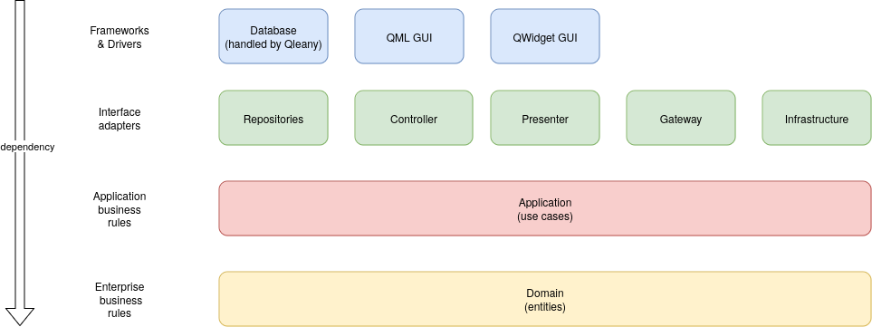
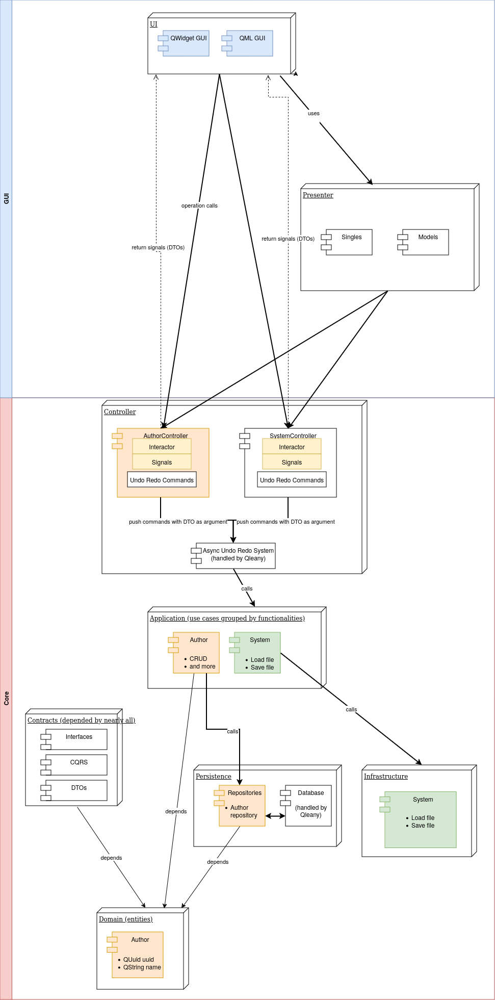
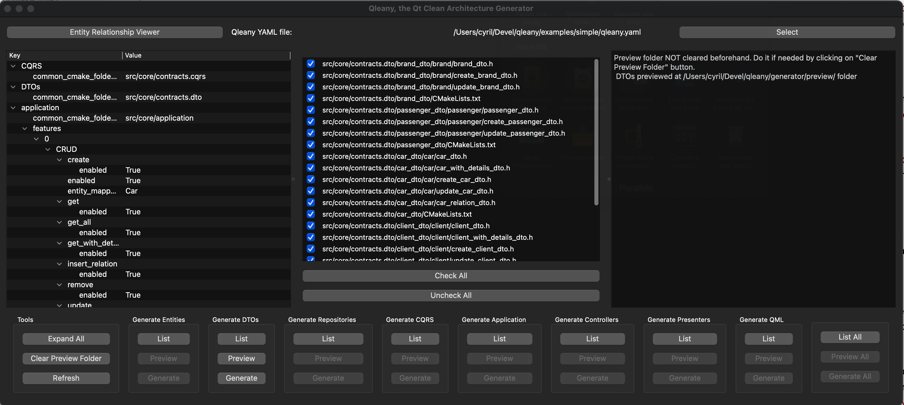

- [Qleany - Clean Architecture Framework for C++/Qt6 Projects](#qleany---clean-architecture-framework-for-c---qt6-projects)
  * [Important Notices](#important-notices)
  * [Framework's Objective](#frameworks-objective)
  * [Why use Qleany ?](#why-use-qleany)
  * [Framework Structure](#framework-structure)
  * [Installing the Qleany library](#installing-the-qleany-library)
    + [Manually](#manually)
  * [Using Qleany](#using-qleany)
    + [For QtWidgets GUI](#for-qtwidgets-gui)
    + [For QtQuick GUI](#for-qtquick-gui)
    + [For KF6 Kirigami GUI](#for-kf6-kirigami-gui)
    + [For multiple Uis](#for-multiple-uis)
    + [Integration with Qt Design Studio projects](#integration-with-qt-design-studio-projects)
    + [Other Fronts](#other-fronts)
    + [Gateway and Infrastructure](#gateway-and-infrastructure)
    + [Custom Commands and Queries](#custom-commands-and-queries)
    + [Using your own database management classes](#using-your-own-database-management-classes)
  * [Qleany GUI](#qleany-gui)
    + [Installing the Qleany GUI Interface](#installing-the-qleany-gui-interface)
    + [How to use the Qleany GUI Interface](#how-to-use-the-qleany-gui-interface)
  * [Qleany YAML Configuration Rules](#qleany-yaml-configuration-rules)
    + [Global Settings](#global-settings)
    + [Entities Definition](#entities-definition)
    + [Repositories Configuration](#repositories-configuration)
    + [Interactor Settings](#interactor-settings)
    + [Application Layer Configuration](#application-layer-configuration)
    + [DTOs (Data Transfer Objects) Configuration](#dtos--data-transfer-objects--configuration)
    + [Contracts Configuration](#contracts-configuration)
    + [Presenter Settings](#presenter-settings)
    + [Front end Configuration](#front-end-configuration)
  * [Development](#development)
    + [Example Projects](#example-projects)

<small><i><a href='http://ecotrust-canada.github.io/markdown-toc/'>Table of contents generated with markdown-toc</a></i></small>

# Qleany - Clean Architecture Framework for C++/Qt6 Projects

Qleany is a streamlined framework designed to integrate Clean Architecture principles within C++ Qt6 applications. It is built on three core components:

1. **Qleany C++/Qt Library**: Provides a range of common and generic tools and classes essential for implementing Clean Architecture in C++/Qt projects.
2. **Python/Jinja2 Project Structure Generator**: Features a dedicated user interface developed using PySide. This generator facilitates the creation of a structured project environment based on the principles of Clean Architecture.
3. **Examples and Documentation**: A collection of examples to guide users in implementing the framework effectively.

## Important Notices

Please avoid using Qt Design Studio version 4.3 (which utilizes Qt 6.6) due to a known issue that impacts Qt versions 6.5.3 and 6.6. This bug can cause crashes in previews (qml2puppet) when working with QML mocks generated by Qleany. We recommend using Qt Design Studio LTS version 4.1 instead, as it is based on Qt 6.5.1 and does not exhibit this problem. Qt Design Studio 4.4 preview seems to run well with Qleany. 

## Framework's Objective

Qleany's primary goal is to automate the generation of a structured project environment for C++/Qt6 applications. This is achieved by interpreting a simple manifest file, named `qleany.yaml`, located at the root of the project. The framework generates a comprehensive structure including folders, CMakeLists.txt, and more than essential C++ files: it will generate whole libraries adapted to your needs. The generated projects support both QWidget and QML GUIs or a combination of both. Upon initial generation, the projects are immediately compilable, requiring developers only to design GUIs and implement custom use cases.

The framework acknowledges the repetitive nature of file creation in Clean Architecture and addresses this by automating the generation of similar files. Tha simplest of the examples in Qleany have 500+ files in 170+ folders, all generated by this tool. So, Sleany generator id doing some heavy lifting, but some places will have to be polished by you.

Additional features include:

- An asynchronous undo-redo system based on the command pattern. A project can ignore the undo part if it is not needed.
- A SQLite-based database layer for data persistence.
- Support for custom use cases with their own signal and with user-defined DTOs (Data Transfer Objects) for inputs and outputs.
- The ability to define both soft and hard relationships between entities, including one-to-one and one-to-many (unordered or ordered) associations. Many-to-many relationships are not supported yet.
- Entities within the framework handle cascade deletion. Additionally, the implementation of soft-deletion (recoverable trash binning) is currently in progress.

## Why use Qleany ?

Qleany is designed to streamline the development process, offering a range of benefits to developers:
- **Consistency**: Qleany ensures a consistent project structure, reducing the time and effort required to create and maintain a project.
- **Clean Architecture**: The framework is built on the principles of Clean Architecture, ensuring a clear separation of concerns and a high level of modularity.
- **Efficiency**: Qleany automates the generation of a comprehensive project structure, saving developers time and effort.
- **Flexibility**: The framework is designed to be flexible, allowing developers to customize and extend the generated project to suit their specific requirements.
- **Ease of Use**: Qleany's user-friendly interface simplifies the process of generating a structured project environment, making it accessible to developers of all skill levels.
- **Testability**: The framework is ease the creation of tests, thanks to the heavy use of interface classes offering a loose coupling between components. The generated code is also designed to be testable, with the use of mocks and the possibility to inject fake classes in the generated code.
- **Support for Multiple Fronts**: Qleany supports the simultaneous development of different fronts, including QML and QWidget GUIs, without any conflict. 
- **(optional) Integration with Qt Design Studio**: Qleany can be used in conjunction with Qt Design Studio, allowing developers to integrate QML imports into their existing QML projects. With mocks.
- **Integration with QCoro**: Qleany can be used in conjunction with QCoro, a library that provides a set of tools for writing asynchronous code in C++ using the coroutines feature introduced in C++20. QCoro is used in the generated code to make the use of asynchronous code easier.

## Framework Structure

Many developers are likely familiar with the following depiction of Clean Architecture:


It's important to note that this conceptual representation needs to be tailored to fit the specific requirements of the language and project at hand. Qleany presents a distinct interpretation of Clean Architecture, uniquely adapted and structured to suit its specific use cases and environment.

Libraries and their respective functionalities are organized as follows:

- **Entities**: Contains entities and is encapsulated in a library named `entities`. This is the place where the domain model is defined, including the entities and their relationships. Also known as the "domain" layer or "enterprise business rules".

- **Application**: Groups use cases by functionalities, organized within a library called `application`. This is the place where the application by itself is defined, with its use cases and their handlers. Also known as the "application businness rules" layer or "use cases" layer. One little rule: a use case cannot depend on another use case, even if the temptation is strong. If it's really needed, delegate the duplicate work to a service following the example of Gateway and Infrasturcture, and use the service in the use cases. This way, the use cases are kept independent from each other and one breaking does not break the others.

- **Persistence**: Manages internal data persistence, see the two sub-sections below.
- **Persistence/repository**: It includes a 'repository' wrapper for persistence interactions, with each entity having its repository. Repositories instances are ultimately stored in the `RepositoryProvider` class. `RepositoryProvider` is provided by the Qleany library.
- **Persistence/database**:Also, you would normally find a `database` folder by to the `repository` folder, containing the SQLite database and its management classes, but these classes are included in the Qleany library. Of course, if needed, you can implement your own database management classes and swap the provided ones with yours.

- **Contracts**: A common library for most other components, housing all interfaces from `persistence`, `gateway`, and `infrastructure`. This design minimizes tight coupling and circular dependencies.

- **DTO Libraries**: Each functionality has its DTO library, facilitating communication with the `application` layer. DTOs are used for both input and output in interactions with the outer layers, such as interactors.

- **CQRS Libraries** (Command Query Responsibility Segregation): The `application` layer is designed to support CQRS, with commands and queries being handled separately. This separation is achieved by using the `CommandHandler` and `QueryHandler` classes. Other classes, such as `CommandValidator` and `QueryValidator`, are used to validate commands and queries, respectively. They are stored away in a separate library called `cqrs`.

- **Gateway**: Optional library for handling remote connections and services. It can be manually added by the developer and is used similarly to repositories in use cases.

- **Infrastructure**: Optional. Handles actions like file management, local settings, and system queries. It's injected into use cases similar to repositories and gateways.

- **Interactor**: Acts as an internal API to invoke use cases, streamlining the interaction between the user interface and application logic.

- **Presenter**: Maintains Qt models and representations of unique entities (referred to as `Singles`), enhancing their integration and usage within the GUI.

- **UI**: The structure allows the simultaneous use of different fronts, each in its own binary. QML and QWidgets UIs can coexist without any conflict. Same for a CLI, an API ... All these fronts will use the same models and interactors. You can have a single main.cpp file for all fronts, or one for each front. It's up to you. Qleany will only generate one for each front. 

Another related point:

- **Registration**: Each component (`persistence`, `gateway`, `infrastructure`, `interactor`) initializes its classes in a corresponding *name*_registration.cpp file, typically called together in the main.cpp.

Project dependencies:


Example of project structure:


## Installing the Qleany library

### Manually

Prerequisites:
- Qt 6.5 (dev packages) 
- QCoro (dev packages)
- Cmake and extra-cmake-modules

Adapt the -j6 to your number of CPU minus one.

CMake options are:
- QLEANY_BUILD_EXAMPLES (default: on)
- QLEANY_BUILD_TESTS (default: on)
- BUILD_SHARED_LIBS (default: off)
- QLEANY_BUILD_WITH_QT_GUI (default: on)

Below is an example of how to compile and install the Qleany static library:
```bash
git clone https://github.com/jacquetc/qleany.git
cd qleany
mkdir build
cd build
cmake -DCMAKE_INSTALL_PREFIX=/usr/local -DQLEANY_BUILD_WITH_QT_GUI=on -DQLEANY_BUILD_EXAMPLES=off -DQLEANY_BUILD_TESTS=off ..
cmake --build . -- -j6
sudo cmake --install .
```

Add `-DBUILD_SHARED_LIBS=on` to the cmake command line to build shared libraries.

Qleany is building and examples are running well if you use Qt Creator or Visual Studio Code with the CMake Tools extension.

## Using Qleany

Note: You can find the qleany library documentation at [https://jacquetc.github.io/qleany/index.html](https://jacquetc.github.io/qleany/index.html)

To use Qleany, follow these steps:

1. Think hard about your project's domain model, the entities, their fields and the relations between these entities. I enjoin you to use a UML tool to draw your domain model, like the ER diagrams of [Mermaid](https://mermaid.live) or PlantUML.
2. Then, draft all the use cases, grouped by features, with their commands and queries, and their DTOs (DTO = data struct for input or output). Think of these as the "verbs" of your application, the actions that can be done by the user or the fronts., like an API internal to your application.
3. Run `qleany init` in the root of your project. It will create a `qleany.yaml` file for you. You can use the `examples/simple/qleany.yaml` or `examples/front_ends/qleany.yaml` files as references. Read the end of this Readme for more details about the `qleany.yaml` file.
4. Fill the `qleany.yaml` file for your project.
5. Run the Qleany GUI interface (`qleany` or `qleany gui`) and select the `qleany.yaml` file.
6. List and select the files you want to generate.
7. To avoid overwriting your current files: Preview the files, it will generate them in a "qleany_preview" folder.
8. If you are sure, generate the files directly. Qleany will generate them in the right place, but will never delete other files.
9. Create CMakelists.txt files to include the generated libraries in your project. You can use the `examples/simple/src/core/CMakeLists.txt` and `examples/simple/src/gui/CMakeLists.txt` files as a reference.
10. For custom commands and queries, you still have to fill the blanks in the generated files. You will find "Q_UNIMPLEMENTED();" in the generated files.

Note: I enjoin you to use sccache if you have a slow computer. It will speed up the compilation of your project after the first compilation. You can use it with the `CMAKE_CXX_COMPILER_LAUNCHER` option set to `sccache` in your CMakeLists.txt file or `-DCMAKE_CXX_COMPILER_LAUNCHER=sccache` in your cmake command line. To install sccache, go to [https://github.com/mozilla/sccache](https://github.com/mozilla/sccache).

### For QtWidgets GUI

A minimal QtWidgets GUI can be generated by Qleany. You only have to fill `front_ends` in the `qleany.yaml` file. Read "Front end Configuration" section below for more details.

If you already have a QtWidgets GUI, you can craete a blank GUI in a sub-folder next to your real one. Then, swap the generated files with your real ones.

Note: You can use the `examples/simple/src/gui/desktop_application` or `examples/front_ends` as references of what is running fine.

11. Your QtWidgets must be, not at the root of the project, but in a dedicated sub-folder, like with did with `examples/simple/src/gui/desktop_application`.
12. You can now start to implement your GUI and use cases. A GUI made with QWidgets will only use `interactor` for commands/queries and Q_SIGNALS. Also, it will use models from `presenter`. Refer to the example for guidance at `examples/front_ends/src/gui/qt_widgets_application/main.cpp`

### For QtQuick GUI

A minimal QML GUI can be generated by Qleany. You only have to fill `front_ends` in the `qleany.yaml` file. Read "Front end Configuration" section below for more details.

If you already have a QtQuick GUI, you can craete a blank GUI in a sub-folder next to your real one. Then, swap the generated files with your real ones.

*Note*: You can use the `examples/front_ends/src/gui/qt_quick_application` as a reference of what is running fine.

11. Your QML GUI must be, not at the root of the project, but in a dedicated sub-folder, like with did with `examples/simple/src/gui/qml_application`.
12. You can now start to implement your GUI and use cases. 

A GUI made with QML will **not** use `interactor` and `presenter`. Wrappers around models, Q_SIGNALS, commands and queries all are generated in the QML `real_imports` folder in the QML folder to be made available from QML. Also, QML mocks are generated in `mock_imports`, to be filled by the developer. Refer to the example for guidance at `examples/front_ends/src/gui/qt_quick_application/main.cpp` and `examples/front_ends/src/gui/qt_quick__application/CMakelists.txt`

### For KF6 Kirigami GUI

A KF6 Kirigami GUI can be generated by Qleany, inspired from the Kirigami template from KDevelop. You only have to fill `front_ends` in the `qleany.yaml` file. Read "Front end Configuration" section below for more details.

Also, mocks are generated in `mock_imports`, to be fine-tuned by the developer. Use the `BUILD_WITH_MOCKS` cmake definition to include the mocks in the build.

### For multiple Uis

Multiple Uis is considered as a rare use case. This merge of multiple Uis is not perfect. In some cases, you may have to rename some files to avoid conflicts.

You can use multiple Uis, like both QtWidgets and QML GUIs, in the same project. You can use the `examples/front_ends` as a reference. The QML and QWidgets GUIs are in their own sub-folders, and a main.cpp file is in each folder.

To set multiple GUIs, read "Front end Configuration" section below for more details.

A CMakeLists.txt file adapted to multiple UIs is generated in the root of the project and includes to folders of the QML and QWidgets GUIs. In this configuration, two binaries are generated, one for each GUI. 

It's technicaclly possible to use the same main.cpp file for both GUIs, and generate only one binary. It's up to you. Qleany will only offer to write a main.cpp in each GUI folder, and you can modify them as you want.


### Integration with Qt Design Studio projects

You can use Qleany with Qt Design Studio. You can use the `examples/simple/src/gui/qml_application` as a reference of what is running fine. This example folder contains a genuine Qt Design Studio project. The QML file generation is tailor-made to be used after a project is created using Qt Design Studio. This folder uses Qt Design Studio's generated CMakeLists.txt. At the minimum, you only have to include the generated `realqmlmodules.cmake` file in your project's CMakeLists.txt file and modify the `src/main.cpp` to register the other librarie, like it's done in the `examples/simple/src/gui/qml_application/src/main.cpp` file.

Qleany also generates mocks for QML files. You can use them to test your QML files without the need of the C++ backend. You have to add "mock_imports" to the importPaths list in the *.qmlproject file  You can use the `examples/simple/src/gui/qml_application` as a reference of what is running fine.

To summarize the steps needed to use Qleany with Qt Design Studio:
1. Create a QML project using Qt Design Studio in a sub folder (ex: my_qds_gui) of the root folder of your project.
2. Add `qml_imports_integration` to the `front_ends` section of the qleany.yaml file and give `my_qds_gui` as the `folder_path`.
3. Generate the files with Qleany GUI.
4. Include the generated `realqmlmodules.cmake` file in my_qds_gui's CMakeLists.txt file.
5. Modify the `src/main.cpp` to register the other libraries, like it's done in the `examples/simple/src/gui/qml_application/src/main.cpp` file.
6. Add "mock_imports" to the importPaths list in the *.qmlproject file.
7. Don't hesitate to restart Qt Design Studio to see the changes. **Actually, I learned that, when in doubt, restart Qt Design Studio.**

Read "Front end Configuration" section below for more details.

### Other Fronts

You can also create a CLI, an API, a gRPC server, or other fronts. You can use the same models and interactors for all fronts. You can have a single main.cpp file for all fronts, or one for each front. It's up to you. 

### Gateway and Infrastructure

The gateway and infrastructure are not generated by Qleany. You have to create them manually. You can use the `examples/simple/src/core/contracts` and `examples/simple/src/core/persistence` as a reference. The `contracts` folder contains the interfaces for the gateway and infrastructure, similar to what is done with the repositories of `persistence`. 

So, if I wanted to add a `gateway`, I would create a `gateway` folder in the `src/core/contracts` folder, and add the interfaces for all the public classes offered by the gateway. Then, I would create a `gateway` folder in the `src/core` folder, and add the implementation of the gateway classes. When needed, use cases (handler) in `application` would have a `gateway` parameter using the interface, like what is already done with the repositories, and the `gateway` classes would be instanciated and injected into `interactor` from inside the `main.cpp` file.

Finally, do not forget a `gateway_registration.cpp` file in the `src/core/gateway` folder to register the gateway classes. 

If you have too much gateway classes, it can be useful to store them inside a "GatewayProvider" class, like what is done with the `RepositoryProvider` that you can find [here](https://jacquetc.github.io/qleany/classQleany_1_1Repository_1_1RepositoryProvider.html).

In a Gateway, we would find connections to remote services like REST APIs and remote databases, and in Infrastructure, we would find connections to local services, like file management, local settings, and system queries. A "loadFile" method in a `FileLoader` class would be an example of an infrastructure service. Same for a `Settings` class or "exportToPdf" method in a `PdfExporter` class. 

The names Gateway and Infrastructure are not mandatory, you can use other names, like Remote and Local, or whatever you want. You can also put all inside a single `Gateway`. It's up to you.

### Custom Commands and Queries

You can add custom commands and queries for each feature in the `application.features` of the `qleany.yaml`. You can use the `examples/simple/qleany.yaml` and `examples/simple/src/core/application` as references. Search for the `Q_UNIMPLEMENTED();` macro in the generated files to find the places to fill with your custom code. Be careful ot not overwrite your custom code when you regenerate the files, use the preview feature of the generator to avoid this or deselect the files you don't want to regenerate.

### Using your own database management classes

When you take into account the classes offered by the Qleany library, `persistence` iis actually composed by a `repository` part and a `database`part, respectively situated in the "Interface Adapters" layer and in the "Frameworks & Drivers" layer of the Clean Architecture circle diagram.

`database` classes are represented by `InterfaceDatabaseTableGroup` and `InterfaceDatabaseContext` interfaces. If the SQLite database management classes provided by Qleany are not enough for your needs, you can implement your own classes and swap the provided ones with yours.

### Quick rules and troubleshooting 

- To allow smooth generation of a list model or single, allow generation of the entire CRUD of the targeted entity in its own feature. If the list is "in_relation_of" another entity, apply this rule to this other entity too. 
- For read-only single and list models, only "get" and "get_all" CRUD functions are needed.
- In a feature, don't mix entities in DTO's entity_mappable_with and CRUD's entity_mappable_with.
- Respect the case for names. It's very often in pascal case. Ex: PascalCase. Only field names are in camel case ( camelCase ). 
- Use "qleany check" deliberately

And lastly, if you think that there is a strange behavior, you only have to create an issue and join the qleany.yaml


## Qleany GUI

### Installing the Qleany GUI Interface

Qleany tooling can be installed using `pip install qleany`. Alternatively, for an easier installation, you can install it using `pipx install qleany` if you have pipx installed, then run `qleany`.


### How to use the Qleany GUI Interface

To access Qleany's user-friendly graphical interface, run `qleany` or `qleany gui` in a terminal. This interface allows developers to efficiently manage file generation. This is the recommended way to generate files.



1. **Run the Qleany GUI**:
   - Run `qleany` or `qleany gui` in a terminal.

2. **Select the `qleany.yaml` File**:
   - Begin by choosing your project's `qleany.yaml` file. This configuration file is essential for the GUI to operate correctly. You can generate this file using the `qleany init` command.

3. **List Available Files**:
   - In the GUI, use the "list" button for each component. This will generate a list of files that can be created for that component.

4. **Select Files to Generate**:
   - Choose the files you want to generate from the provided list, depending on your project requirements.

5. **Preview Files**:
   - Opt for the "preview" feature to generate and inspect the selected files in a "preview" folder. The location of this folder is defined in your `qleany.yaml` file.

6. **Generate Files**:
   - After previewing, proceed to generate the files by clicking the "generate" button. This will create the files in their designated locations within your project.

7. **Overwrite Confirmation**:
   - Should the file generation process require overwriting existing files, a warning message will appear. This alert ensures you are informed about and agree to the upcoming changes to your current files.

Alternatively, you can list and generate all the files of the project.


## Qleany YAML Configuration Rules

The `qleany.yaml` file is the core configuration file for the Qleany framework. A new qleany.yaml can be generated using `qleany init` command in the root directory of your project. A working example can be found in `example/front_ends/qleany.yaml` or `example/simple/qleany.yaml`. Below are the rules and structure for defining the configuration:

### Global Settings
```yaml
global:
  application_name: SimpleExample
  application_cpp_domain_name: Simple
  organisation:
    name: simpleexample
    domain: qleany.eu
```

### Entities Definition

Defines entities and their properties. Setting parent to EntityBase (provided by Qleany) offers the "id" field of type "int". It's mandatory to use EntityBase as heritage.
```yaml
entities:
  list:
    - name: EntityName
      parent: ParentEntity
      only_for_heritage: true/false
      fields:
        # basic:
        - type: DataType
          name: fieldName
          hidden: true/false (default: false)
        # one-to-one relationship:
        - type: OtherEntityName
          name: fieldName
          strong: true/false
          hidden: true/false (default: false)
        # one-to-many relationship:
        - type: QList<OtherEntityName>
          name: fieldName
          strong: true/false
          ordered: true/false
          hidden: true/false (default: false)
        # other fields ...
    # other entities ...
  folder_path: path/to/entity/folder
```

### Repositories Configuration

Specifies settings for entity repositories.

```yaml
repositories:
  list:
    - entity_name: EntityName
      lazy_loaders: true/false
    # other repositories, typically one for each entity
  repository_folder_path: path/to/repository/folder
  base_folder_path: path/to/base/folder
```

### Interactor Settings

Configures interactor-specific settings.

```yaml
interactor: 
  folder_path: path/to/interactor/folder
  create_undo_redo_interactor: true/false
```
### Application Layer Configuration

Defines application-specific settings and CRUD operations.

```yaml
application:
  common_cmake_folder_path: path/to/application/folder
  features:
    - name: FeatureName
      DTO:
        dto_identical_to_entity:
          enabled: true/false
          entity_mappable_with: EntityName
      CRUD:
        enabled: true/false (default: false)
        entity_mappable_with: EntityName
        get:
          enabled: true/false
        get_all:
          enabled: true/false
        get_with_details:
          enabled: true/false
        create: 
          enabled: true/false
        remove: 
          enabled: true/false
        update: 
          enabled: true/false       
        insert_relation: 
          enabled: true/false        
        remove_relation: 
          enabled: true/false 
      commands:
        - name: CommandName
          entities:
            - EntityName
          validator: 
            enabled: true/false 
          undo: true/false 
          dto:
            in:
              enabled: true/false (default: true)
              type_prefix: CommandName
              fields:
                - type: DataType
                  name: fieldName
            out:
              enabled: true/false (default: true)
              type_prefix: CommandNameReply
              fields:
                - type: DataType
                  name: fieldName
      queries:
        - name: QueryName
          entities:
            - EntityName
          validator: 
            enabled: true/false 
          undo: false (useless for queries)
          dto:
            in:
              enabled: true/false (default: true)
              type_prefix: QueryName
              fields:
                - type: DataType
                  name: fieldName
            out:
              type_prefix: QueryNameReply
              fields:
                - type: DataType
                  name: fieldName
              
```

### DTOs (Data Transfer Objects) Configuration

```yaml
DTOs:
  common_cmake_folder_path: path/to/dtos/folder
```

### Contracts Configuration

Defines settings for contracts in the application.

```yaml
contracts:
  inverted_app_domain: domain.identifier
  folder_path: path/to/contracts/folder
```

### Presenter Settings

Configures presenter-specific settings. Note: the `name` can be set to `auto`

```yaml
presenter:
  folder_path: path/to/presenter/folder
  create_undo_and_redo_singles: true/false (default false)
  singles:
    - name: SingleName (or "auto")
      entity: EntityName
      read_only: true/false (default: false)
    # Additional singles...
  list_models:
    - name: ListModelName (or auto)
      entity: EntityName
      displayed_field: fieldName
      in_relation_of: RelationEntity
      relation_field_name: relationFieldName
      read_only: true/false (default: false)
    # Additional list models...

```

### Front end Configuration

Specifies the front end settings, like the folder path which is mandatory. A folder_path is a sub-folder of the project folder. It will generate basic files for the front end, like a main.cpp file, and a CMakeLists.txt file.

`qml_imports_integration` is a folder containing generated QML imports. It's useful if you want to integrate imports into your exisiting QML project or you Qt Design Studio project. It's not mandatory.

To set multiple GUIs, fill the `front_ends` section multiple times, like in the example below.

```yaml
front_ends:
  qt_widgets:
    folder_path: path/to/qt_widgets_application_folder
  qt_quick:
    folder_path: path/to/qt_quick_application_folder
  kf6_kirigami:
    folder_path: path/to/kf6_kirigami_application_folder
  qml_imports_integration:
    folder_path: path/to/qml_imports_integration_folder
```

## Development

### Example Projects

  Be careful while generating CMakeLists.txt files for example projects. Since the examples are built at the same time than the library, you will have to comment out the `find_package(qleany CONFIG REQUIRED)` in each CMakeLists.txt file of the examples.

### Qleany generator

#### Another way to install and run it

You can also install the Qleany generator using poetry. You can use the following commands to install and run the Qleany generator:
`poetry install` to install the dependencies.
`poetry run qleany` to run the Qleany GUI.

On VS Code, with the Python extension, you can right click on "tool/qleany/generator/qleany_generator_gui.py" and select "Run Python File in Terminal" to run the Qleany GUI.