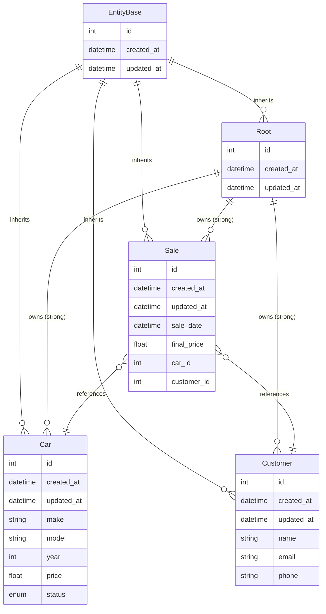

# Qleany Quick Start

This guide walks you through creating a complete desktop application for a car dealership using Qleany. By the end, you'll have generated architecture scaffolding with entities, repositories, controllers, and undo/redo infrastructure.

> **Note:** This guide demonstrates Rust generation. The workflow for C++ / Qt6 is nearly identical — only the generated output differs. Language-specific differences are noted where relevant.

---

## Step 1: Think About Your Domain

Before touching any tool, grab paper or open a diagramming tool. This is the most important step.

**Ask yourself:**
- What are the core "things" in my business? These become entities.
- What actions do users perform? These become use cases.
- Which use cases belong together? These become features.

### Example: CarLot — A Car Dealership App

**Entities** (the nouns):

| Entity | Purpose | Key Fields |
|--------|---------|------------|
| EntityBase | Base class for all entities | id, created_at, updated_at |
| Root | Application entry point, owns everything | cars, customers, sales |
| Car | Vehicle in inventory | make, model, year, price, status |
| Customer | Potential or actual buyer | name, email, phone |
| Sale | Completed transaction | sale_date, final_price, car, customer |

**Relationships:**

- Root owns many Cars (inventory)
- Root owns many Customers (contacts)
- Root owns many Sales (history)
- Sale references one Car (what was sold)
- Sale references one Customer (who bought it)

**Features and Use Cases** (the verbs):

| Feature | Use Case | What it does |
|---------|----------|--------------|
| inventory_management | import_inventory | Parse CSV file, populate Car entities |
| inventory_management | export_inventory | Generate CSV from current inventory |

### Draw It First

Sketch your entities and relationships before using Qleany. Use paper, whiteboard, or Mermaid:



**Why draw first?** Changing a diagram is free. Changing generated code is work. Get the model right before generating.

---

## Step 2: Create a New Manifest

Launch Qleany. You'll land on the **Home** tab.

1. Click **New Manifest**
2. Choose where to save `qleany.yaml` (your project root)

Qleany creates a minimal manifest with:
- `EntityBase` (provides id, created_at, updated_at)
- Empty `Root` entity inheriting from EntityBase

---

## Step 3: Configure Project Settings

Click **Project** in the sidebar.

Fill in the form:

| Field | Value                  |
|-------|------------------------|
| Language | Rust *(or C++ / Qt)*   |
| Application Name | CarLot                 |
| Organisation Name | mycompany              |
| Organisation Domain | mycompany.com          |
| Prefix Path | crates *(or src for C++ / Qt)* |

Changes save. The header shows "Save Manifest" when there are unsaved changes.

---

## Step 4: Define Entities

Click **Entities** in the sidebar. You'll see a three-column layout.

### 4.1 Create the Car Entity

1. Click the **+** button next to "Entities"
2. A new entity appears — click it to select
3. In the details panel:
   - **Name**: `Car`
   - **Inherits from**: `EntityBase`

Now add fields. In the "Fields" section:

1. Click **+** to add a field
2. Select the new field, then configure:

| Name | Type | Notes |
|------|------|-------|
| make | String | — |
| model | String | — |
| year | Integer | — |
| price | Float | — |
| status | Enum | Enum Name: `CarStatus`, Values: `Available`, `Reserved`, `Sold` (one per line) |

### 4.2 Create the Customer Entity

1. Click **+** next to "Entities"
2. **Name**: `Customer`
3. **Inherits from**: `EntityBase`
4. Add fields:

| Name | Type |
|------|------|
| name | String |
| email | String |
| phone | String |

### 4.3 Create the Sale Entity

1. Click **+** next to "Entities"
2. **Name**: `Sale`
3. **Inherits from**: `EntityBase`
4. Add fields:

| Name | Type | Configuration |
|------|------|---------------|
| sale_date | DateTime | — |
| final_price | Float | — |
| car | Entity | Referenced Entity: `Car`, Relationship: `many_to_one` |
| customer | Entity | Referenced Entity: `Customer`, Relationship: `many_to_one` |

### 4.4 Configure Root Relationships

Select the **Root** entity. Add relationship fields:

| Name | Type | Configuration |
|------|------|---------------|
| cars | Entity | Referenced Entity: `Car`, Relationship: `ordered_one_to_many`, Strong: ✓ |
| customers | Entity | Referenced Entity: `Customer`, Relationship: `ordered_one_to_many`, Strong: ✓ |
| sales | Entity | Referenced Entity: `Sale`, Relationship: `ordered_one_to_many`, Strong: ✓ |

> **C++ / Qt6 only:** You can also enable **List Model** and **Single Model** checkboxes to generate reactive QAbstractListModel and its QML wrappers. Set **Displayed Field** to specify which field appears in list views (e.g., `make` for cars, `name` for customers). These options are not available (or useless) for Rust.

**Key concepts:**
- **Strong relationship**: Deleting Root cascades to delete all Cars, Customers, Sales

---

## Step 5: Define Features and Use Cases

Click **Features** in the sidebar. You'll see a four-column layout.

### 5.1 Create the Feature

1. Click **+** next to "Features"
2. Select it and set **Name**: `inventory_management`

### 5.2 Create the Import Use Case

1. Click **+** next to "Use Cases"
2. Configure:

| Field | Value                                           |
|-------|-------------------------------------------------|
| Name | import_inventory                                |
| Undoable | ✗ *(file imports typically aren't undoable)*    |
| Read Only | ✗ *(it will update the internal database)*      |
| Long Operation | ✓ *(parsing files can take time)*               |

> **Note:** Long Operation is currently implemented for Rust only. For now, C++ / Qt6 ignores this setting.

3. Switch to the **DTO In** tab:
   - Enable the checkbox
   - **Name**: `ImportInventoryDto`
   - Add field: `file_path` (String)

4. Switch to the **DTO Out** tab:
   - Enable the checkbox
   - **Name**: `ImportResultDto`
   - Add fields: `imported_count` (Integer), `error_messages` (String, List: ✓)

5. Switch to the **Entities** tab:
   - Check: `Root`, `Car`

### 5.3 Create the Export Use Case

1. Click **+** next to "Use Cases"
2. Configure:

| Field | Value                            |
|-------|----------------------------------|
| Name | export_inventory                 |
| Undoable | ✗                                |
| Read Only | ✓ *(just reading internal data)* |
| Long Operation | ✗                                |

> **Note:** Long Operation is currently implemented for Rust only.

3. **DTO In**:
   - **Name**: `ExportInventoryDto`
   - Field: `output_path` (String)

4. **DTO Out**:
   - **Name**: `ExportResultDto`
   - Field: `exported_count` (Integer)

5. **Entities**: Check `Root`, `Car`

---

## Step 6: Save and Generate

### Save the Manifest

Click **Save Manifest** in the header (or Ctrl+S).

### Commit to Git

Before generating, commit your current state to Git. This isn't optional advice — it's how Qleany is meant to be used. If you accidentally overwrite files you've modified, you can restore them.

```bash
git add .
git commit -m "Before Qleany generation"
```

### Generate Code

1. Click **Generate** in the sidebar
2. Click **List Rust Files** to populate the file list
3. Review the groups and files
4. (Optional) Check **in temp/** to generate to a temporary folder first
5. Click a file to preview the generated code
6. Click **Generate (N)** where N is the number of selected files

The progress modal shows generation status. Files are written to your project.

---

## Step 7: What You Get

After generation, your project contains:

```
Cargo.toml
crates/
├── cli/
│   ├── src/
│   │   ├── main.rs    
│   └── Cargo.toml
├── common/
│   ├── src/
│   │   ├── entities.rs             # Car, Customer, Sale structs
│   │   ├── database.rs
│   │   ├── database/
│   │   │   ├── db_context.rs
│   │   │   ├── db_helpers.rs
│   │   │   └── transactions.rs
│   │   ├── direct_access.rs
│   │   ├── direct_access/         # Holds the repository and table implementations for each entity
│   │   │   ├── car.rs
│   │   │   ├── car/
│   │   │   │   ├── car_repository.rs
│   │   │   │   └── car_table.rs
│   │   │   ├── customer.rs
│   │   │   ├── customer/
│   │   │   │   ├── customer_repository.rs
│   │   │   │   └── customer_table.rs
│   │   │   ├── sale.rs
│   │   │   ├── sale/
│   │   │   │   ├── sale_repository.rs
│   │   │   │   └── sale_table.rs
│   │   │   ├── root.rs
│   │   │   ├── root/
│   │   │   │   ├── root_repository.rs
│   │   │   │   └── root_table.rs
│   │   │   ├── repository_factory.rs
│   │   │   └── setup.rs
│   │   ├── event.rs             # event system for reactive updates
│   │   ├── lib.rs
│   │   ├── long_operation.rs    # infrastructure for long operations
│   │   ├── types.rs         
│   │   └── undo_redo.rs        # undo/redo infrastructure
│   └── Cargo.toml
├── direct_access/                   # a direct access point for UI or CLI to interact with entities
│   ├── src/
│   │   ├── car.rs
│   │   ├── car/
│   │   │   ├── car_controller.rs   # Exposes CRUD operations to UI or CLI
│   │   │   ├── dtos.rs
│   │   │   ├── units_of_work.rs
│   │   │   ├── use_cases.rs
│   │   │   └── use_cases/          # The logic here is auto-generated
│   │   │       ├── create_car_uc.rs
│   │   │       ├── get_car_uc.rs
│   │   │       ├── update_car_uc.rs
│   │   │       ├── remove_car_uc.rs
│   │   │       └── ...
│   │   ├── customer.rs
│   │   ├── customer/
│   │   │   └── ...
│   │   ├── sale.rs
│   │   ├── sale/
│   │   │   └── ...
│   │   ├── root.rs
│   │   ├── root/
│   │   │   └── ...
│   │   └── lib.rs
│   └── Cargo.toml
└── inventory_management/
    ├── src/
    │   ├── inventory_management_controller.rs
    │   ├── dtos.rs
    │   ├── units_of_work.rs
    │   ├── units_of_work/          # ← adapt the macros here too
    │   │   └── ...
    │   ├── use_cases.rs
    │   ├── use_cases/              # ← You implement the logic here
    │   │   └── ...
    │   └── lib.rs
    └── Cargo.toml

```

**What's generated:**
- Complete CRUD for all entities (create, get, update, remove, ...)
- Controllers exposing operations
- DTOs for data transfer
- Repository pattern for database access
- Undo/redo infrastructure for undoable operations
- Event system for reactive updates
- Basic CLI (if selected during project setup)
- Basic empty UI (if selected during project setup)

**What you implement:**
- Your custom use case logic (import_inventory, export_inventory)
- Your UI or CLI on top of the controllers or their adapters

---

## Tips

### Understanding the Internal Database

Entities are stored in an internal database (redb for Rust, SQLite for C++/Qt). This database is **internal** — users and UI devs don't interact with it directly.

**Typical pattern:**

1. User opens a file (e.g., `.carlot` project file)
2. Your `load_project` use case parses the file and populates entities
3. User works — all changes go to the internal database
4. User saves — your `save_project` use case serializes entities back to file

The internal database is ephemeral. It enables fast operations, undo/redo. The user's file is the permanent storage.

### Undo/Redo

Every generated CRUD operation supports undo/redo automatically. You don't have to display undo/redo controls in your UI if you don't want to — but the infrastructure is there when you need it.

If you mark a use case as **Undoable**, Qleany generates the command pattern scaffolding. You fill in what "undo" means for your specific operation.

For more information, see [Undo-Redo Architecture](docs/undo-redo-architecture.md).

### Relationships

| Relationship | Use When |
|--------------|----------|
| one_to_one | Exclusive 1:1 (User → Profile) |
| many_to_one | Child references parent (Sale → Car) |
| one_to_many | Parent owns unordered children |
| ordered_one_to_many | Parent owns ordered children (chapters in a book) |
| many_to_many | Shared references (Items ↔ Tags) |

**Strong** means cascade delete — deleting the parent deletes children.

For more details, see [Manifest Reference](docs/manifest-reference.md#field-types-and-relationships).

### Starting Fresh

Made a mistake? The manifest is just YAML. You can:
- Edit it directly in a text editor
- Delete entities/features in the UI and recreate them
- Generate to a temp folder, review, then regenerate to the real location

---

## Build

### Rust
From your project root:

```bash
cargo build
```

### C++ / Qt6
From your project root:
```bash
mkdir -p build && cd build
cmake ..
cmake --build .
```

## Next Steps

1. Run the generated code — it compiles and provides working CRUD
2. Implement your custom use cases (`import_inventory`, `export_inventory`)
3. Build your UI on top of the controllers
4. Add more features as your application grows

The generated code is yours. Modify it, extend it, or regenerate when you add new entities. Qleany gets out of your way.

---

## Further Reading

- [README](README.md) — Overview, building and running, reference implementation
- [Manifest Reference](docs/manifest-reference.md) — Entity options, field types, relationships, features
- [Design Philosophy](docs/design-philosophy.md) — Clean Architecture background, package by feature
- [Regeneration Workflow](docs/regeneration-workflow.md) — How file generation works, what gets overwritten
- [Undo-Redo Architecture](docs/undo-redo-architecture.md) — Entity tree structure, undoable vs non-undoable
- [QML Integration](docs/qml-integration.md) — Reactive models and mocks for C++/Qt
- [Mobile Development](docs/mobile-development.md) — Plasma Mobile, Ubuntu Touch, cross-platform deployment
- [Generated Infrastructure](docs/generated-code.md) — Database layer, event system, file organization
- [Troubleshooting](docs/troubleshooting.md) — Common issues and how to fix them
